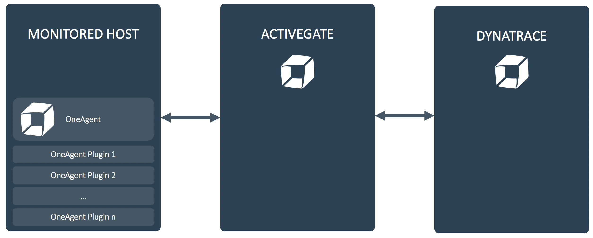
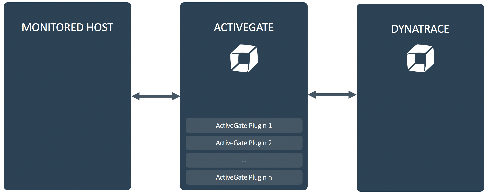

# Extending Monitoring

This is the home of the Dynatrace Extending Monitoring workshop.

Information: dominik.sachsenhofer@dynatrace.com

 
 

# Contents

### Prerequisites

__Prerequisites__

https://github.com/dynatrace-innovationlab/extending-monitoring/tree/master/prerequisites

 
 

__Lab 1: OneAgent Plugins__

- Task 1: Preparing a host to monitor
- Task 2: Deploy Dynatrace
- Task 3: Build and deploy an OneAgent Plugin

https://github.com/dynatrace-innovationlab/extending-monitoring/tree/master/lab1

 
 

__Lab 2: ActiveGate Plugins__

- Task 1: Preparing a host to monitor
- Task 2: Setup an ActiveGate
- Task 3: Build and deploy an ActiveGate Plugin

https://github.com/dynatrace-innovationlab/extending-monitoring/tree/master/lab2
